github上搭建一个自己的静态博客

本篇博客参考众多视频和博客以及博主自己的尝试，区别于hexo等需要编译的博客，流程可能有点乱，不过有助于你们多尝试犯错。

# 1.github基本配置

## 1.1 new一个

新建一个 Repositories

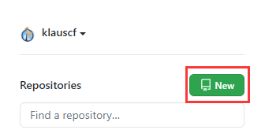

输入自己的网站名，并创建

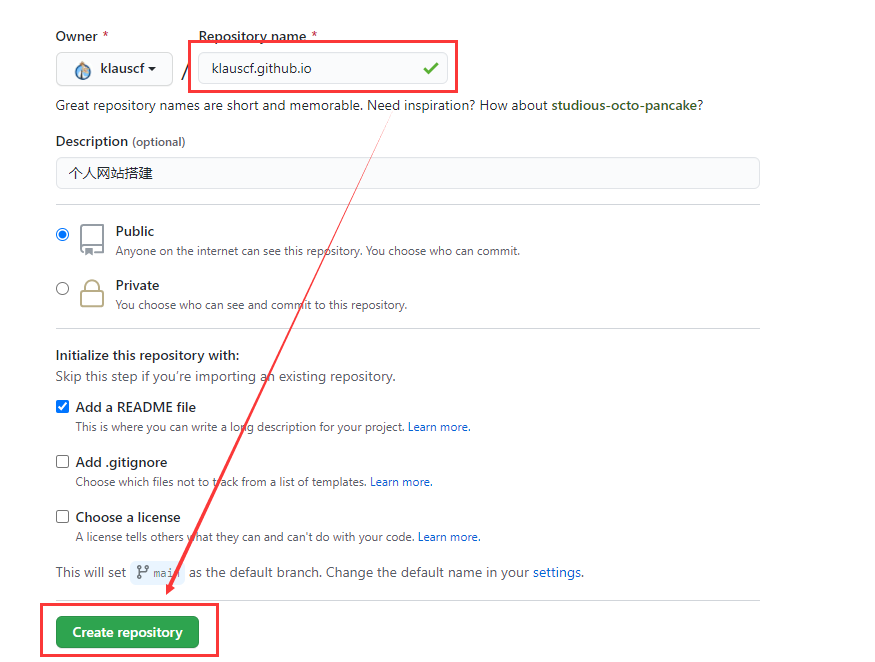

## 1.2 fork一个
因为要用到借助jekyll-now搭建 这一步我建议放前面，和前面有重叠的地方

第一步fork jekyll-now到本地，参考GitHub[链接](https://github.com/barryclark/jekyll-now)。

fork完了之后，修改成自己的名字

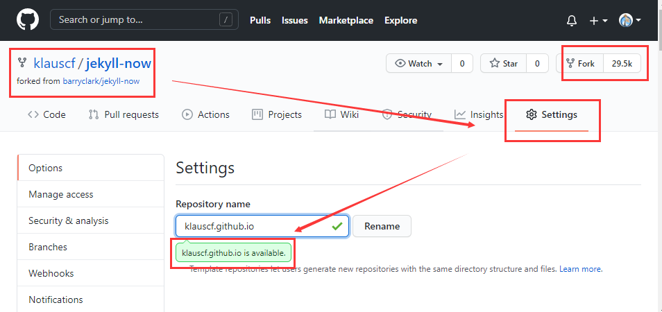

创建完成状态如下

## 1.3 下载一个github desktop
需要下载一个github desktop版
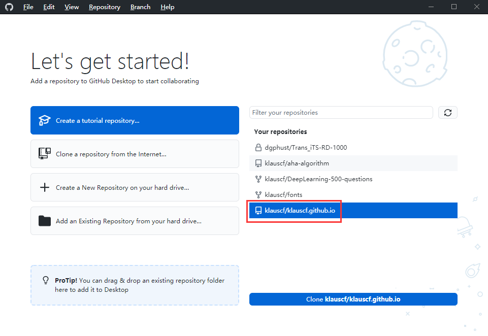
将当前新建的仓库clone到本地，完成后状态如下
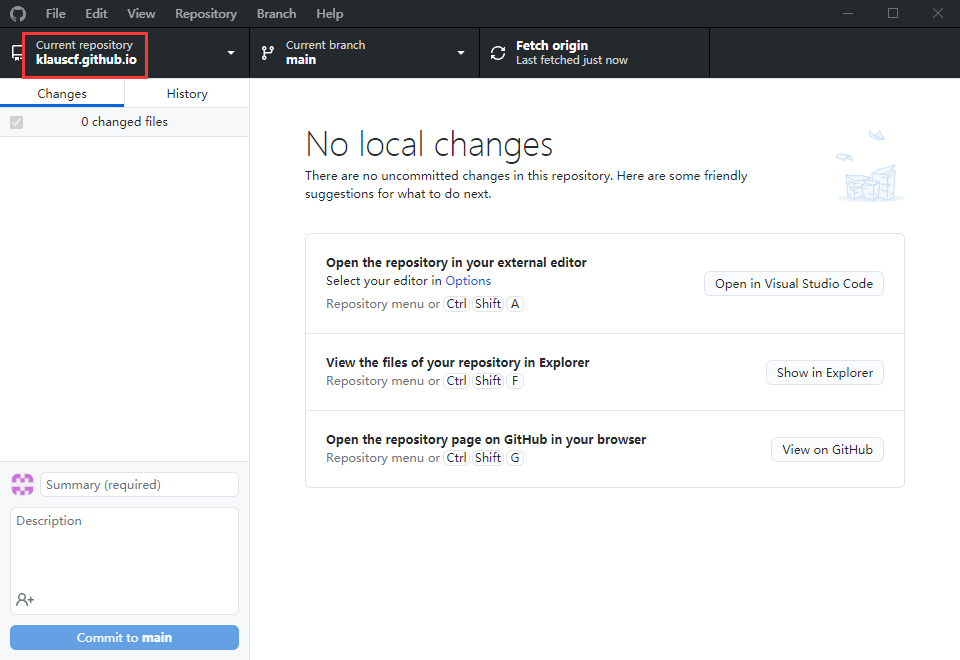

然后在本地目录添加部分文件
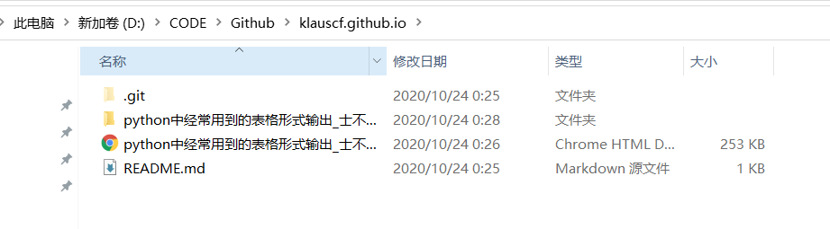

此时desktop版更新，添加特定描述并点击commit  to mian完成之后，点击push origin发布到网站
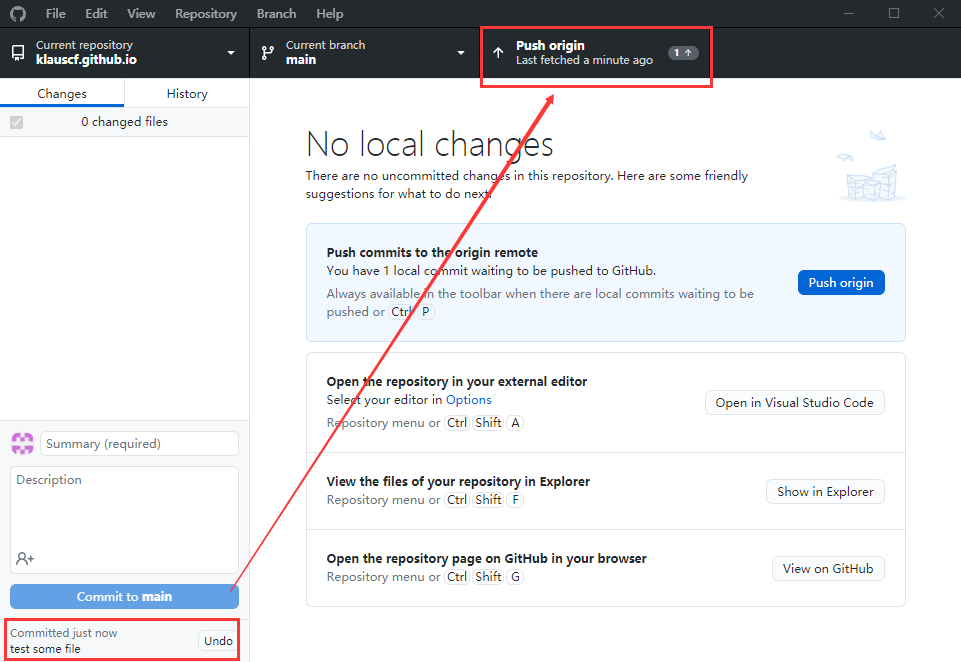

打开自己的网站，就能看到此时的某些更新
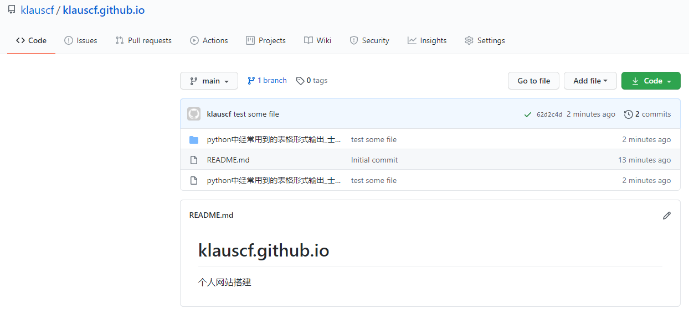

点击setting就能发现此时网站可以访问
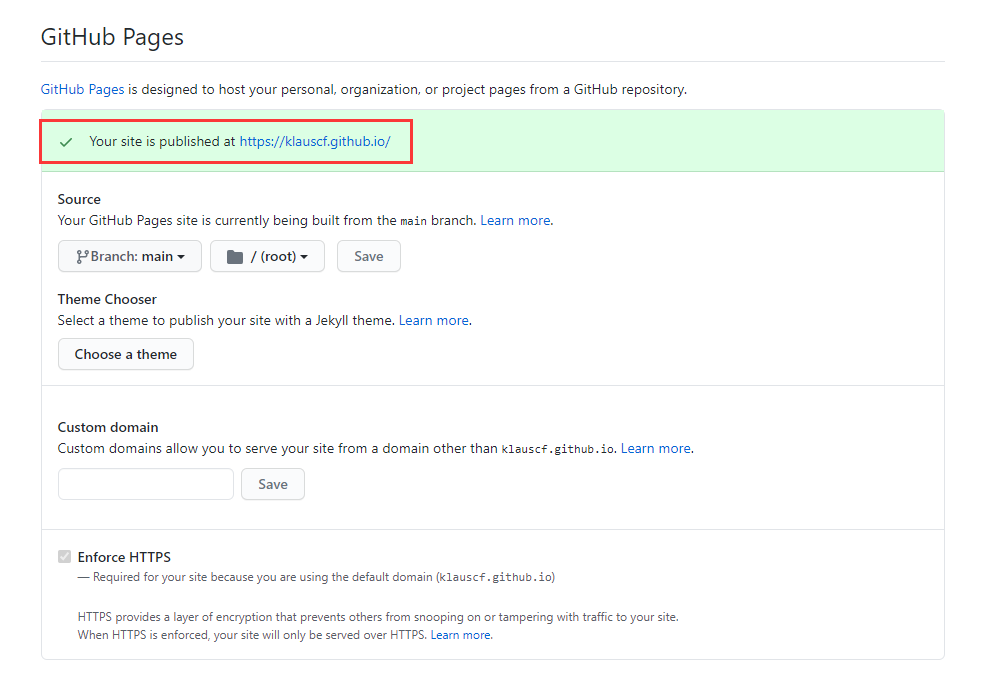

# 2.申请自己的域名
## 2.1 freenom申请域名
自己在freenom里面注册一个自己的域名，这里是参考视频[链接](https://www.bilibili.com/video/BV1tA411q7BA?from=search&seid=16470974238878212865)。
上面是我自己申请的网站klauscf.tk，有几个后缀域名不要钱，尽量我们可以选不要钱的，可以用一年

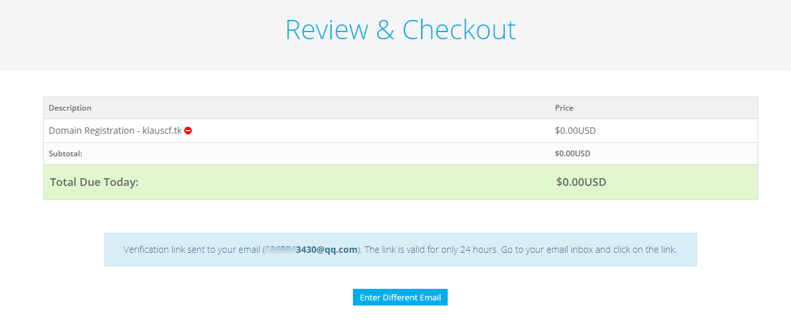

最后域名申请成功
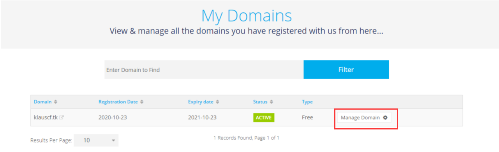

## 2.2 cloudflare做域名解析
这里需要自己申请账号，在主页中点击添加站点，我们需要配置一些信息

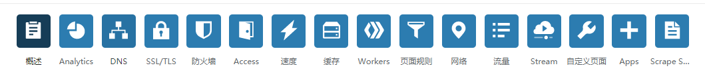

当然，你也可以参照网站上的流程，需要更改的几个点

在cloudflare上配置自己github上的参数
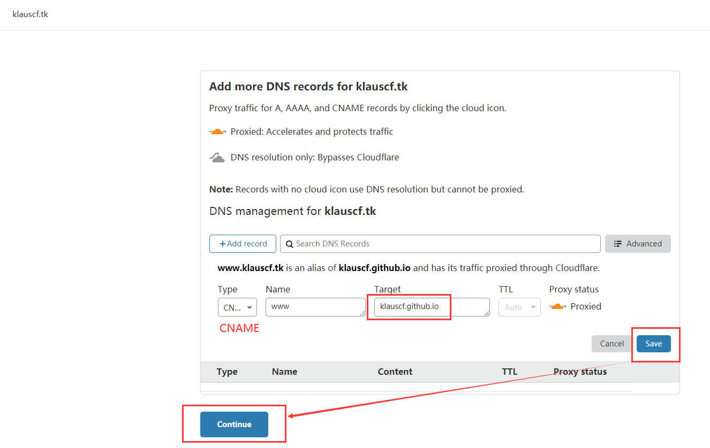

更改dns解析
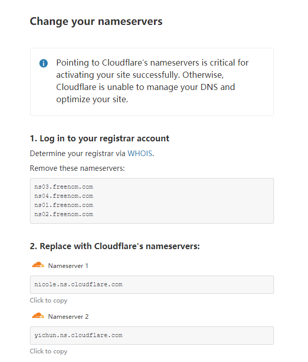
网站会自动解析你的dns，这里我们转到cloudflare上面去，记住这里需要选择还是免费的那个

其他配置信息

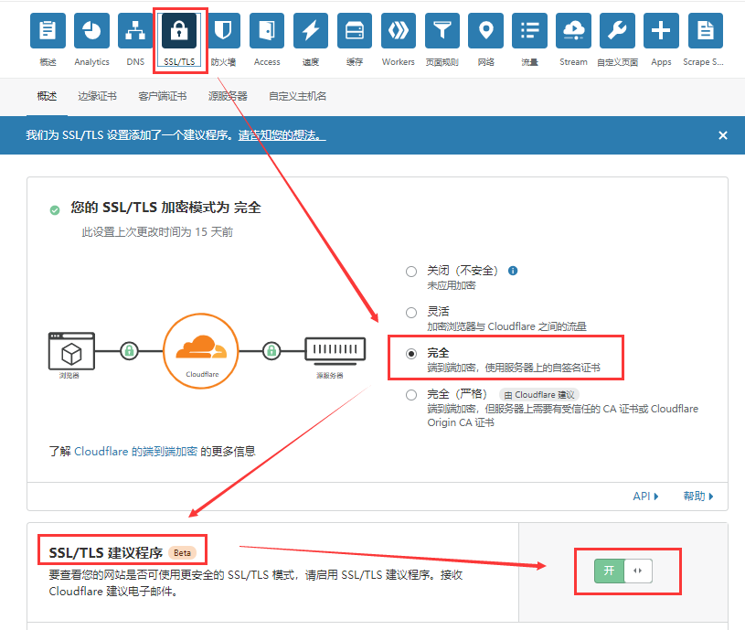

始终使用https，这个相比http附带ssl加密（https好像必须打开ssl）

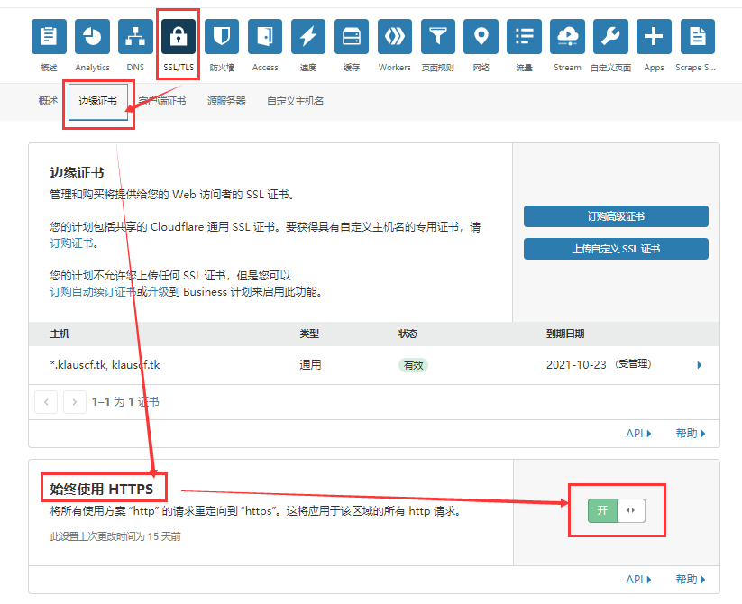

## 2.3 修改dns解析

登录freenom更改dns解析
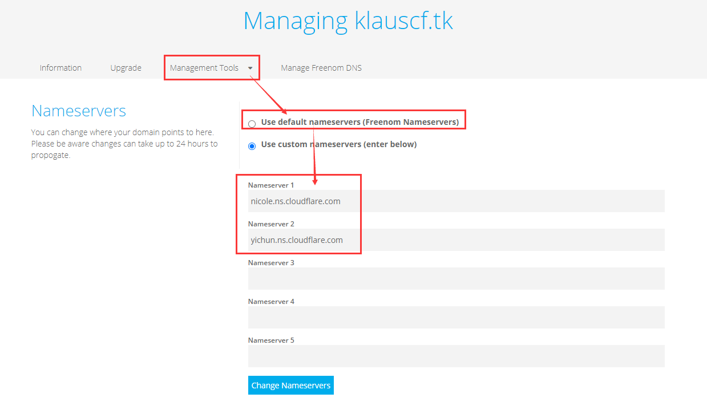

# 3.链接自己的网站
按上面步骤，你已经有了一个自己的网站
下面更新github下面的设置，添加custom domain
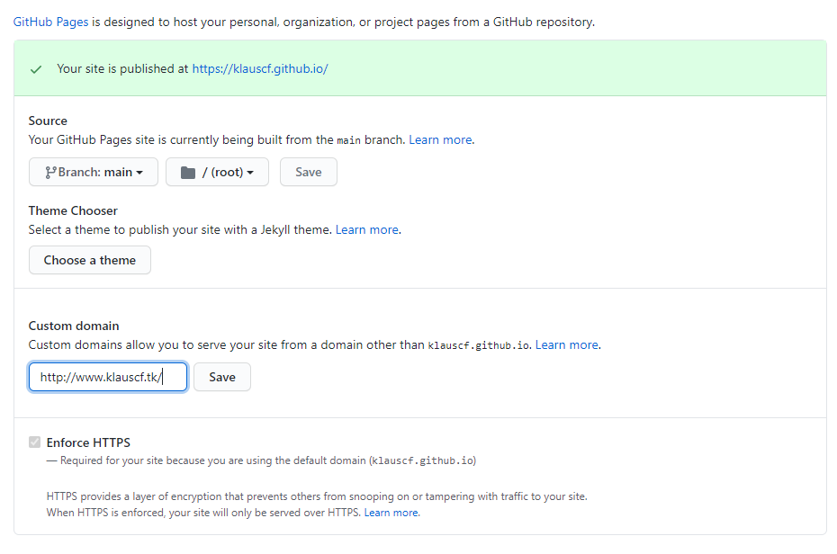

添加完成后，你看到下面场景你就成功了

# 4.写自己的博客
写博客的形式很多，这里我主要介绍1.2的那个
简单介绍一下，jekyll里面有个about.md，这里主要写的是自己博客的解释，比如

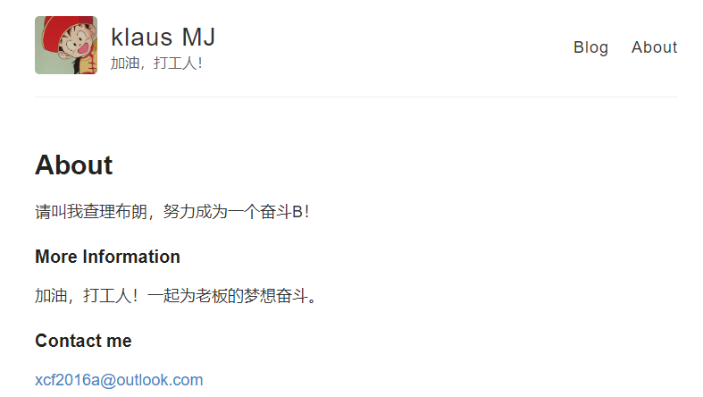

还有一个_config.yml文件，主要是我们博客的一些参考信息，后续要改的话，参考这里

重点戏来了就是如下写一篇博客，就是在有个_posts的文件夹，我们通过本地的的vscode的编写

在_posts新建一个md文件，好像名字格式有要求，必须是时间+名字这种，头配置不能丢

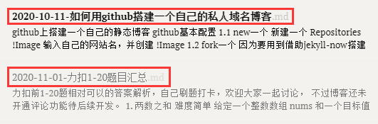

然后安装markdown形式开始写博客。

经过多天尝试，发现了一个较为简单的方式，不需要编译，直接编写，然后更新就可以

具体方式就是：typora+git bash，我来展示一下我自己的方式

## A.关于项目

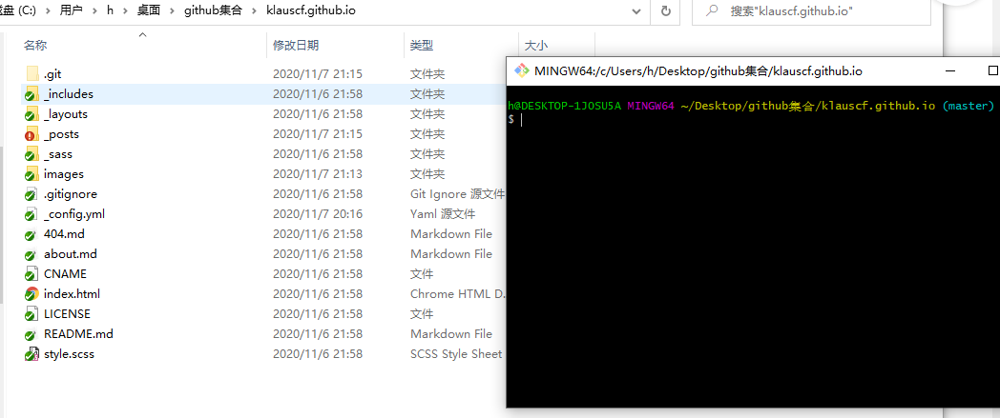

在本地把项目clone下来

## B.关于图片

需要在typora中设置一下上传图片格式，然后每次贴过来就可以了

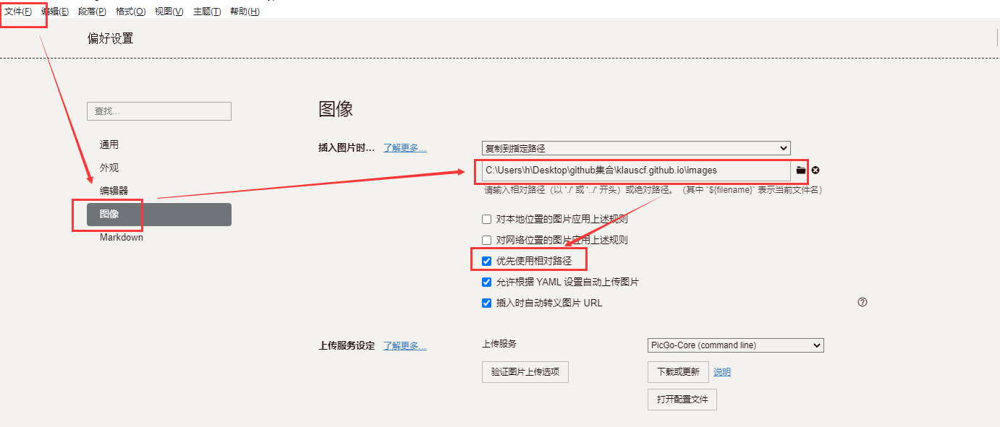

贴的过程中你会发现如下效果

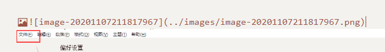

你本地images文件就会存这些照片，然后更新上去因为是相对路径，不会存在读取问题

## C.关于更新

无论是desktop还是git bash，在你自己配好相关环境后，更新其实是一样的，这里我的一个较为简单的命令就是下面这种

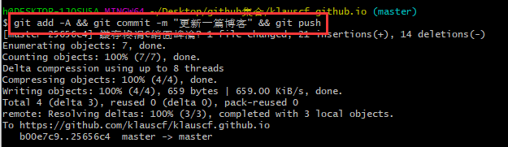

用github desktop更简单。