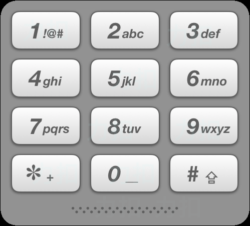

力扣前10-20题相对可以的答案解析，自己刷题打卡，欢迎大家一起讨论，

不过博客还未开通评论功能待后续开发。

## [11. 盛最多水的容器](https://leetcode-cn.com/problems/container-with-most-water/)

难度中等1970

给你 `n` 个非负整数 `a1，a2，...，a``n`，每个数代表坐标中的一个点 `(i, ai)` 。在坐标内画 `n` 条垂直线，垂直线 `i` 的两个端点分别为 `(i, ai)` 和 `(i, 0)` 。找出其中的两条线，使得它们与 `x` 轴共同构成的容器可以容纳最多的水。

**说明：**你不能倾斜容器。

 

**示例 1：**


```
输入：[1,8,6,2,5,4,8,3,7]
输出：49 
解释：图中垂直线代表输入数组 [1,8,6,2,5,4,8,3,7]。在此情况下，容器能够容纳水（表示为蓝色部分）的最大值为 49。
```

**示例 2：**

```
输入：height = [1,1]
输出：1
```

**示例 3：**

```
输入：height = [4,3,2,1,4]
输出：16
```

**示例 4：**

```
输入：height = [1,2,1]
输出：2
```

**提示：**

- `n = height.length`
- `2 <= n <= 3 * 104`
- `0 <= height[i] <= 3 * 104`

解答：这个题就比较直接，注意指针变换条件

```c++
class Solution {
public:
    int maxArea(vector<int>& height) {

        int l = 0;
        int r = height.size()-1;
        int res;

        while(l<r)
        {
            if(height[l]<height[r]){
                res = max(res, min(height[r],height[l]) * (r-l));
                l++;
            }
            else
            {
                res = max(res, min(height[r],height[l]) * (r-l));
                r--;
            }
        }
        return res;
    }
};
```

## [12. 整数转罗马数字](https://leetcode-cn.com/problems/integer-to-roman/)

罗马数字包含以下七种字符： `I`， `V`， `X`， `L`，`C`，`D` 和 `M`。

```
字符          数值
I             1
V             5
X             10
L             50
C             100
D             500
M             1000
```

例如， 罗马数字 2 写做 `II` ，即为两个并列的 1。12 写做 `XII` ，即为 `X` + `II` 。 27 写做 `XXVII`, 即为 `XX` + `V` + `II` 。

通常情况下，罗马数字中小的数字在大的数字的右边。但也存在特例，例如 4 不写做 `IIII`，而是 `IV`。数字 1 在数字 5 的左边，所表示的数等于大数 5 减小数 1 得到的数值 4 。同样地，数字 9 表示为 `IX`。这个特殊的规则只适用于以下六种情况：

- `I` 可以放在 `V` (5) 和 `X` (10) 的左边，来表示 4 和 9。
- `X` 可以放在 `L` (50) 和 `C` (100) 的左边，来表示 40 和 90。 
- `C` 可以放在 `D` (500) 和 `M` (1000) 的左边，来表示 400 和 900。

给定一个整数，将其转为罗马数字。输入确保在 1 到 3999 的范围内。

**示例 1:**

```
输入: 3
输出: "III"
```

**示例 2:**

```
输入: 4
输出: "IV"
```

**示例 3:**

```
输入: 9
输出: "IX"
```

**示例 4:**

```
输入: 58
输出: "LVIII"
解释: L = 50, V = 5, III = 3.
```

**示例 5:**

```
输入: 1994
输出: "MCMXCIV"
解释: M = 1000, CM = 900, XC = 90, IV = 4.
```

这个题刚刚开始写的map，发现map给自动排序了

```c++
class Solution {
public:
    string intToRoman(int num) {
            vector<pair<int,string>> table={
            {1000,"M"},{900,"CM"},{500,"D"},{400,"CD"},
            {100,"C"},{90,"XC"},{50,"L"},{40,"XL"},{10,"X"},
            {9,"IX"},{5,"V"},{4,"IV"},{1,"I"},
        };
        string res;
        for(auto &s : table){
            //std::cout << s.first << ':' << s.second << endl;
            while(num >=s.first){
                res += s.second;
                num -= s.first;
            }
        }
        return res;
    }
};
```


## [13. 罗马数字转整数](https://leetcode-cn.com/problems/roman-to-integer/)

难度简单1112收藏分享切换为英文接收动态反馈

罗马数字包含以下七种字符: `I`， `V`， `X`， `L`，`C`，`D` 和 `M`。

```
字符          数值
I             1
V             5
X             10
L             50
C             100
D             500
M             1000
```

例如， 罗马数字 2 写做 `II` ，即为两个并列的 1。12 写做 `XII` ，即为 `X` + `II` 。 27 写做 `XXVII`, 即为 `XX` + `V` + `II` 。

通常情况下，罗马数字中小的数字在大的数字的右边。但也存在特例，例如 4 不写做 `IIII`，而是 `IV`。数字 1 在数字 5 的左边，所表示的数等于大数 5 减小数 1 得到的数值 4 。同样地，数字 9 表示为 `IX`。这个特殊的规则只适用于以下六种情况：

- `I` 可以放在 `V` (5) 和 `X` (10) 的左边，来表示 4 和 9。
- `X` 可以放在 `L` (50) 和 `C` (100) 的左边，来表示 40 和 90。 
- `C` 可以放在 `D` (500) 和 `M` (1000) 的左边，来表示 400 和 900。

给定一个罗马数字，将其转换成整数。输入确保在 1 到 3999 的范围内。

 

**示例 1:**

```
输入: "III"
输出: 3
```

**示例 2:**

```
输入: "IV"
输出: 4
```

**示例 3:**

```
输入: "IX"
输出: 9
```

**示例 4:**

```
输入: "LVIII"
输出: 58
解释: L = 50, V= 5, III = 3.
```

**示例 5:**

```
输入: "MCMXCIV"
输出: 1994
解释: M = 1000, CM = 900, XC = 90, IV = 4.
```

 

**提示：**

- 题目所给测试用例皆符合罗马数字书写规则，不会出现跨位等情况。
- IC 和 IM 这样的例子并不符合题目要求，49 应该写作 XLIX，999 应该写作 CMXCIX 。
- 关于罗马数字的详尽书写规则，可以参考 [罗马数字 - Mathematics ](https://b2b.partcommunity.com/community/knowledge/zh_CN/detail/10753/罗马数字#knowledge_article)。

代码思路：主要在什么时候判断9，4这类数

```c++
class Solution {
public:
    int romanToInt(string s) {
        map<char,int>hashMap {
            {'M',1000},{'D',500},{'C',100},{'L',50},
            {'X',10},{'V',5},{'I',1},
        };
        int res=0;
        for(int i=0;i<s.size();i++){
            if(i>0 && hashMap[s[i]]>hashMap[s[i-1]])
                res -= 2 * hashMap[s[i-1]];
            res += hashMap[s[i]];
        }
        return res;
    }
};
```

## [14. 最长公共前缀](https://leetcode-cn.com/problems/longest-common-prefix/)

难度简单1339收藏分享切换为英文接收动态反馈

编写一个函数来查找字符串数组中的最长公共前缀。

如果不存在公共前缀，返回空字符串 `""`。

**示例 1:**

```
输入: ["flower","flow","flight"]
输出: "fl"
```

**示例 2:**

```
输入: ["dog","racecar","car"]
输出: ""
解释: 输入不存在公共前缀。
```

**说明:**

所有输入只包含小写字母 `a-z` 。

代码块：这个题的考点是前缀，开始想迷糊了，保证前缀是一样的才能往下走

```
class Solution {
public:
    string longestCommonPrefix(vector<string>& strs) {
        if(strs.size()==0) return "";
        string res=strs[0];
        for(auto &x : strs){
            res = doubleComStr(res,x);
            //cout << "res: " << res << "x: " << x << endl;
        }
        return res;
    }

    string doubleComStr(string const &s1,string const &s2){
        int length = min(s1.size(),s2.size());
        int index=0;
        while(index<length && s1[index] == s2[index])
            index++;
        return s1.substr(0,index);
    }
};
```


## [15. 三数之和](https://leetcode-cn.com/problems/3sum/)

难度中等2741收藏分享切换为英文接收动态反馈

给你一个包含 *n* 个整数的数组 `nums`，判断 `nums` 中是否存在三个元素 *a，b，c ，*使得 *a + b + c =* 0 ？请你找出所有满足条件且不重复的三元组。

**注意：**答案中不可以包含重复的三元组。

 

**示例：**

```
给定数组 nums = [-1, 0, 1, 2, -1, -4]，

满足要求的三元组集合为：
[
  [-1, 0, 1],
  [-1, -1, 2]
]
```

代码块：参考2数之和

```c++
class Solution {
public:
    vector<vector<int>> threeSum(vector<int>& nums) {
        vector<vector<int>> res;
        sort(nums.begin(),nums.end());

        for(int i=0;i<nums.size();i++){
            if(i>0 && nums[i-1] == nums[i])  continue;
            unordered_set<int> hash;
            for(int j=i+1;j<nums.size();j++){
                if (j > i + 2 && nums[j] == nums[j-1] && nums[j-2] == nums[j-1]) continue;
                int tmp = 0 - nums[i] - nums[j];
                
                if(hash.find(tmp) != hash.end()){
                    res.push_back({nums[i],nums[j],tmp});
                    hash.erase(tmp);
                }else
                    hash.insert(nums[j]);
            }
        }
        return res;
    }
};
```


## [16. 最接近的三数之和](https://leetcode-cn.com/problems/3sum-closest/)

难度中等627收藏分享切换为英文接收动态反馈

给定一个包括 *n* 个整数的数组 `nums` 和 一个目标值 `target`。找出 `nums` 中的三个整数，使得它们的和与 `target` 最接近。返回这三个数的和。假定每组输入只存在唯一答案。

 

**示例：**

```
输入：nums = [-1,2,1,-4], target = 1
输出：2
解释：与 target 最接近的和是 2 (-1 + 2 + 1 = 2) 。
```

 

**提示：**

- `3 <= nums.length <= 10^3`
- `-10^3 <= nums[i] <= 10^3`
- `-10^4 <= target <= 10^4`

写了一个很简单的暴力

```c++
class Solution {
public:
    int threeSumClosest(vector<int>& nums, int target) {
        
        sort(nums.begin(),nums.end());
        int n = nums.size();

        int diff=0,minabs=INT_MAX;
        int res=0;
        for(int i=0;i<n;i++){
            for(int j=i+1;j<n-1;j++){
                for(int cur=j+1;cur<n;cur++){
                    diff =target - (nums[i] + nums[j]);
                    if(abs(diff-nums[cur])<=minabs){
                        minabs = abs(diff-nums[cur]);
                        res = nums[i] + nums[j] + nums[cur];
                    }
                }
            }
        }
        return res;
    }  
};
```

后来改成了一个双指针的写法

```c++
class Solution {
public:
    int threeSumClosest(vector<int>& nums, int target)
    {
        sort(nums.begin(),nums.end());
        int n = nums.size();
        int best = INT_MAX;
        int res;
        for(int i=0;i<n;i++)
        {
            int j=i+1,k=n-1;
            while(j<k)
            {
                int sum = nums[i] + nums[j] + nums[k];
                if(sum < target)
                    j++;
                else if(sum == target)
                    return sum;
                else
                    k--;
                if(abs(sum-target)<best){
                    best = abs(sum-target);
                    res = sum;
                }
            }
        }
        return res;
    }  
};
```

## [17. 电话号码的字母组合](https://leetcode-cn.com/problems/letter-combinations-of-a-phone-number/)

难度中等988收藏分享切换为英文接收动态反馈

给定一个仅包含数字 `2-9` 的字符串，返回所有它能表示的字母组合。

给出数字到字母的映射如下（与电话按键相同）。注意 1 不对应任何字母。



**示例:**

```
输入："23"
输出：["ad", "ae", "af", "bd", "be", "bf", "cd", "ce", "cf"].
```

**说明:**
尽管上面的答案是按字典序排列的，但是你可以任意选择答案输出的顺序。

好久没写dfs，看了一下别人代码。思路好是很清晰

```c++
class Solution {
public:
    string tmp;
    vector<string> res;
    vector<string> table= {"","","abc","def","ghi","jkl","mno","pqrs","tuv","wxyz"};

    void dfs(int index, string digits){
        if(index==digits.size()){
            res.push_back(tmp);
            return ;
        }

        int n = digits[index]-'0';
        for(int i=0;i<table[n].size();i++){
            tmp.push_back(table[n][i]);//都放一遍
            dfs(index+1,digits);
            tmp.pop_back();
        }
    }

    vector<string> letterCombinations(string digits) {
        if(digits.size()==0) return res;
        dfs(0,digits);
        return res;
    }
};
```

