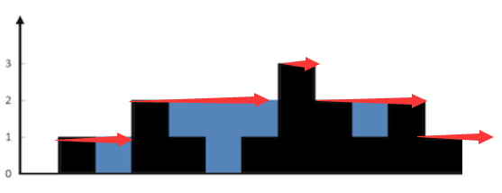

力扣前31-40题相对可以的答案解析，自己刷题打卡，欢迎大家一起讨论，

不过博客还未开通评论功能待后续开发。

## [41. 缺失的第一个正数](https://leetcode-cn.com/problems/first-missing-positive/)

难度困难869

给你一个未排序的整数数组，请你找出其中没有出现的最小的正整数。

 

**示例 1:**

```
输入: [1,2,0]
输出: 3
```

**示例 2:**

```
输入: [3,4,-1,1]
输出: 2
```

**示例 3:**

```
输入: [7,8,9,11,12]
输出: 1
```

 

**提示：**

你的算法的时间复杂度应为O(*n*)，并且只能使用常数级别的额外空间。

### 代码思路

这道题没看懂也懒得去看那个[1-N+1]的那个思路，直接写了一个简单的

```
class Solution {
public:
    int firstMissingPositive(vector<int>& nums) {
        unordered_map<int,int> hash;
        for(auto x : nums) hash[x]++;
        int i=1;
        while(hash[i]!=0)
            i++;
        return i;
    }
};
```

## [42. 接雨水](https://leetcode-cn.com/problems/trapping-rain-water/)

难度困难1836

给定 *n* 个非负整数表示每个宽度为 1 的柱子的高度图，计算按此排列的柱子，下雨之后能接多少雨水。

 

**示例 1：**


```
输入：height = [0,1,0,2,1,0,1,3,2,1,2,1]
输出：6
解释：上面是由数组 [0,1,0,2,1,0,1,3,2,1,2,1] 表示的高度图，在这种情况下，可以接 6 个单位的雨水（蓝色部分表示雨水）。 
```

**示例 2：**

```
输入：height = [4,2,0,3,2,5]
输出：9
```

 

**提示：**

- `n == height.length`
- `0 <= n <= 3 * 104`
- `0 <= height[i] <= 105`

### 代码思路

第一个做一遍找最大，右一遍找最小，找到如同所示的水平线



代码如下

```c++
class Solution {
public:
    int trap(vector<int>& height) {
        int res=0;
        int tmpleftmax = -1;
        int tmprightmax = -1;
        vector<int> dp(height.size(),-1);

        for(int i=0;i<height.size();i++){
            tmpleftmax = max(tmpleftmax,height[i]);
            dp[i] = tmpleftmax;
        }

        for(int i=height.size()-1;i>=0;i--)
        {
            tmprightmax = max(tmprightmax,height[i]);
            dp[i] = min(dp[i],tmprightmax);
            res += dp[i] - height[i];
        }
        return res;
    }
};
```

然后我自己另外写了一个逐层递减超时的

```c++
class Solution {
public:
    int trap(vector<int>& height) {
        int maxh=0;
        for(auto x:height) maxh = max(maxh,x);
        int res=0;
        for(int minh=0;minh<maxh; minh++)
        {
            int startflag=0;
            int left=0,right=0;
            for(int i=0;i<height.size();i++){
                if(height[i]>0 && startflag == 0){
                    left = i;
                    startflag = 1;
                }
                if(height[i]>0 && startflag==1)
                    right = i;
            }

            for(int i=0;i<height.size();i++)
            {
                if(i>=left && i<=right && height[i]==0)
                    res ++;
            }

            for(int i=0;i<height.size();i++)
                if(height[i]>0)height[i]--;
        }
        return res;
    }
};
```


## [43. 字符串相乘](https://leetcode-cn.com/problems/multiply-strings/)

难度中等529

给定两个以字符串形式表示的非负整数 `num1` 和 `num2`，返回 `num1` 和 `num2` 的乘积，它们的乘积也表示为字符串形式。

**示例 1:**

```
输入: num1 = "2", num2 = "3"
输出: "6"
```

**示例 2:**

```
输入: num1 = "123", num2 = "456"
输出: "56088"
```

**说明：**

1. `num1` 和 `num2` 的长度小于110。
2. `num1` 和 `num2` 只包含数字 `0-9`。
3. `num1` 和 `num2` 均不以零开头，除非是数字 0 本身。
4. **不能使用任何标准库的大数类型（比如 BigInteger）**或**直接将输入转换为整数来处理**。

### 代码思路

这个题我按照常规的那种乘法算的，效果还行

```c++
#include <sstream>
class Solution {
public:
    string multiply(string num1, string num2) {
        int n1 = num1.size();
        int n2 = num2.size();
        if(n1==0 && n2==0) return "";

        vector<int> s(n1+n2,0);
        for(int i=0;i<n1;i++)
            for(int j=0;j<n2;j++)
                s[i+j+1] += (num1[i]-'0')*(num2[j]-'0');
        
        for(int i=n1+n2-1;i>=0;i--){
            if(s[i]>=10){
                s[i-1] += s[i]/10;
                s[i] = s[i]%10;
            }
        }

        string res;
        int index=0;
        while(s[index]==0 && index<s.size()-1) index++;//去除头元素为0的
        for(;index<s.size();index++)
            res += s[index]+'0';
        return res;
    }
};
```

