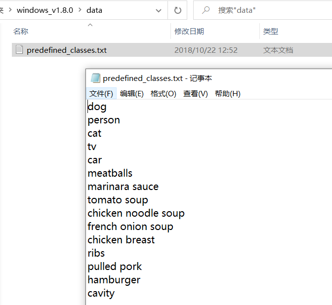
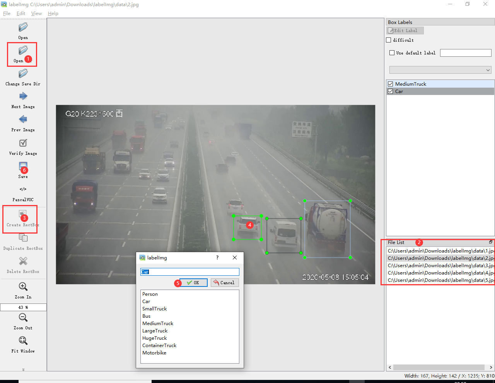
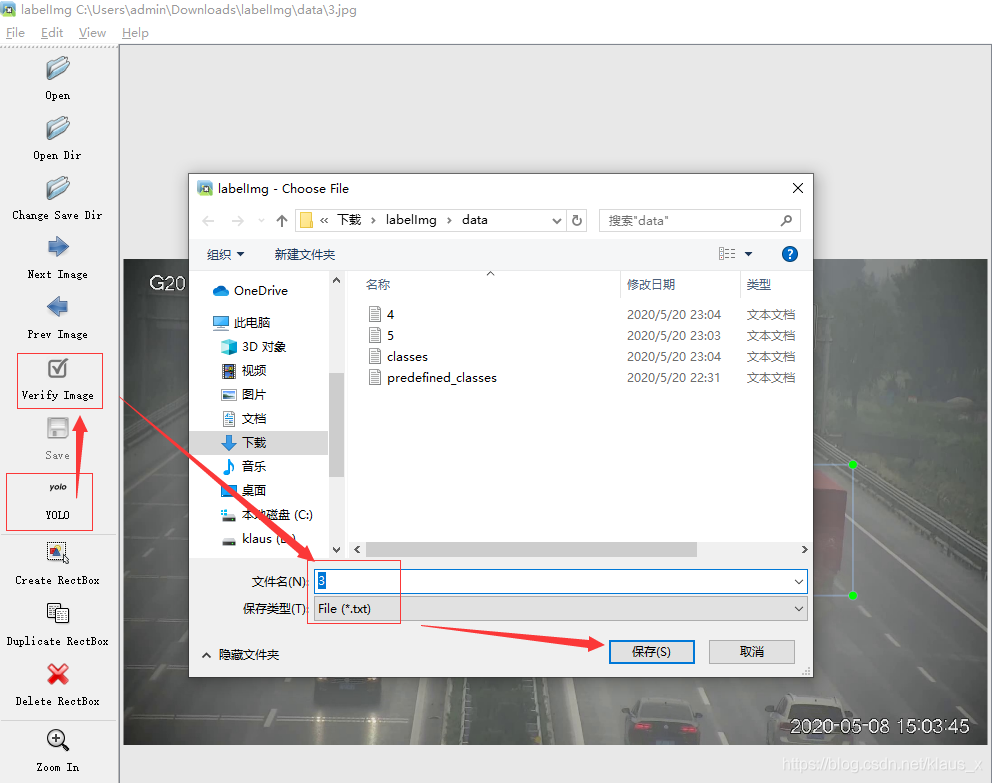
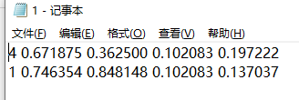
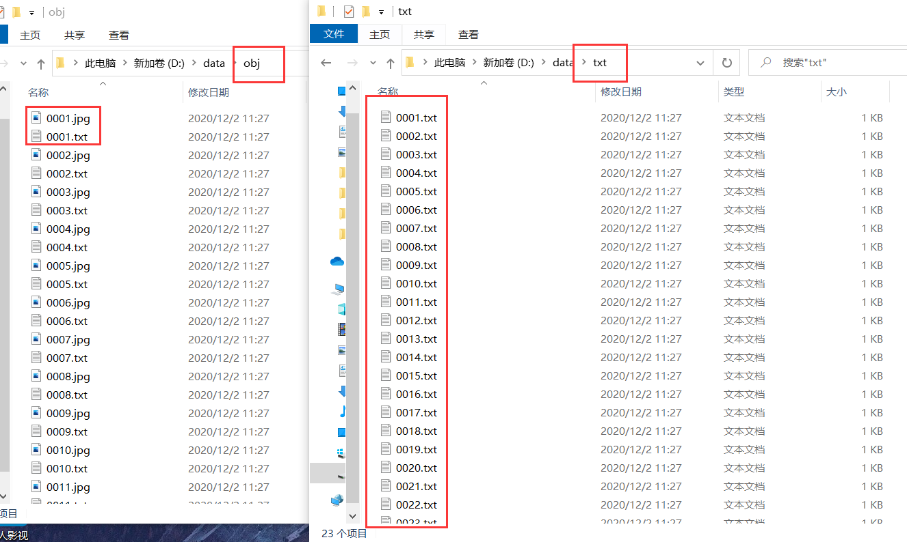
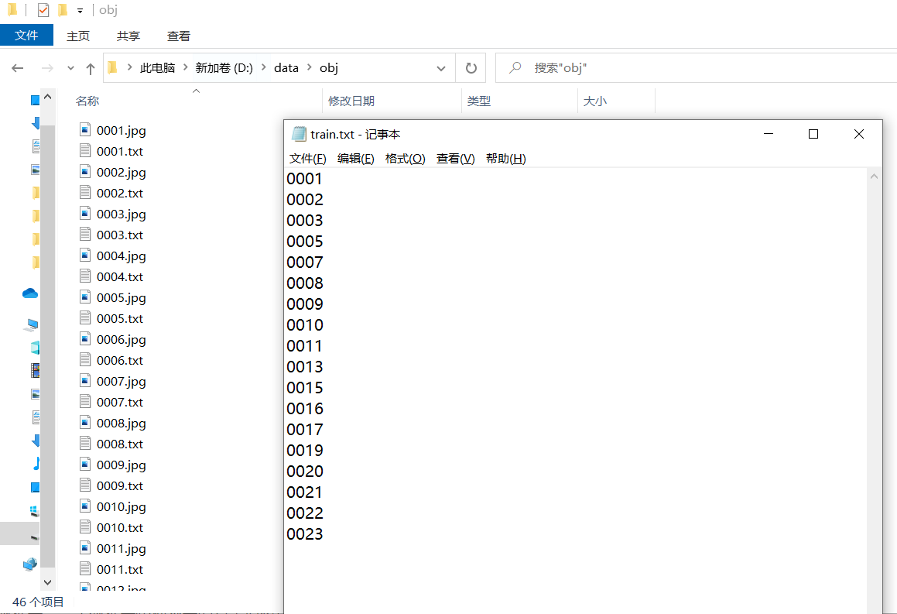
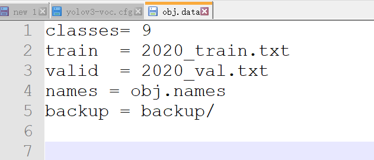
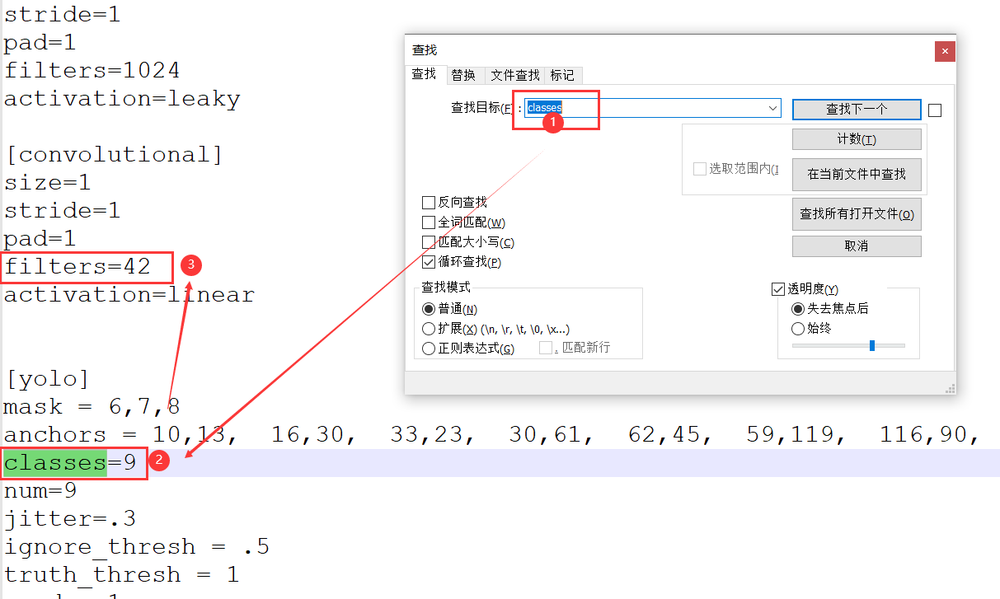

基于yolov3的训练的几点说明

# 1.训练数据的制备

环境要求：

​		python环境：   能够运行.py文件，支持python2-3

​		深度学习环境：以集成在运行文件夹中

系统环境要求：        win7/win10

显卡要求：                必须有显卡，显卡内存建议大于8G

## 1.1自定义识别物体类别

打开解压的windows_v1.8.0下的data目录下的predefined_classes.txt，设定自己数据集中的类别名，如下有20类待识别的物体名称



## 1.2 标注图片

双击labelImg.exe运行软件（注意目录下面不能有中文路径），将所要标注的图片拷贝至data目录
点击opendir，批量打开所要标注的data文件夹，然后会在右下角的FileList看到所有图片
上面的修改的predefined_classes.txt，是自己定义的类，一行是一类



一般需要xml文件，这里是yolo训练的，直接用yolo格式的，在软件这里也可以转过去，点击PascalVOC，转成YOLO格式，点击Verify Image，然后保存就可以生成yolo格式的标注文件（这里一定要生产yolo的格式，显示格式如下图YOLO）



## 1.3 保存生成txt文件

最后在data下面就可以看到yolo格式文件，如下图。第2，3项为标注目标的框的中心像素在图片的位置，4，5项为框的大小（下面数值是归一化的结果）



# 2.调整训练样本格式

完成所有样本的制备之后，将所有标注的图片和txt文件拷贝到训练文件的data目录下，其中txt和对应的图片文件放在obj文件夹下，然后txt单独存放在txt文件夹下，如下图所示



## 2.1 生成训练集和验证集

打开fileNameWrite.py脚本，在train_percent中设置训练集和验证集比例，代码如下

```python
import os
from os import listdir, getcwd
from os.path import join
import random

if __name__ == '__main__':
    root_path = os.getcwd() #获取当前工作目录路径
    source_folder= root_path + '/txt'

    train_percent = 0.90
    file_list=os.listdir(source_folder)
    
    num = len(file_list)
    list = range(num)
    #print(list)    
    tv = int(num * train_percent)
    train = random.sample(list, tv)
    print("train size:", tv)
    
    ftrain = open(root_path + '/train.txt','w') 
    fval = open(root_path + '/val.txt','w')
 
    for i in list:
        #if(file_list[i][-4:] == '.txt'):
        name = file_list[i][:-4] + '\n'
        if i in train:
            ftrain.write(name)
        else:
            fval.write(name)
    
    ftrain.close() 
    fval.close()
```

​		其中root_path可能获取不了路径，也可以通过绝对路径的方式，如root_path= 'D:/train_yolo_1/yolo/train_cuda10/data'

如train_percent = 0.8是所有样本的80%的当训练集，剩余20%当验证集，运行脚本，其中验证集和训练集的名字信息存放在train.txt和val.txt中



完成之后，需要在上一级目录中的writename_yolo.py脚本中生成完整版的路径，下面的选出的代码块

```python
import os
from os import listdir, getcwd
from os.path import join

# wd = getcwd()
wd = 'D:/train_yolo_1/yolo/train_cuda10'

for year, image_set in sets:
    image_ids = open('%s/data/%s.txt'%(wd,image_set)).read().strip().split()
    list_file = open('%s_%s.txt'%(year, image_set), 'w')
    for image_id in image_ids:
        list_file.write('%s\dataset\obj\%s.jpg\n'%(wd,image_id))
        #convert_annotation(year, image_id)
    list_file.close()
```

这里需要手动修改对应的目录文件，修改其中的wd路径，如上面的wd = 'D:/train_yolo_1/yolo/train_cuda10'，完成之后运行脚本生成的路径在2020_train.txt文件中


## 2.2 修改相关的配置文件

### 2.2.1 修改obj.name

打开obj.name,修改其中类别名称，注意这里面的类别需要和上面predefined_classes.txt里面的内容一致，建议拷贝过来

### 2.2.2 修改obj.data

修改class类别数目，如待检测目标有20类，设置class=20，其余的是训练文件和验证文件，按原来的即可，backup文件是存放训练生成的模型文件，模型会在没1000此迭代生成一次，每次训练需要建一个空的backup文件夹



### 2.2.3 修改.cfg文件

用记事本打开.cfg,其中修改的地方有6个地方，主要是2个点

修改class为2.2.1对应的类别数目如9，然后计算一下filters的值，计算方式是(classes+5)\*3,如9的话，就是14\*3=42



其中这样的要修改3次，建议用ctrl + F查找，总共修改地方6此次

# 3.训练yolo模型			

完成上面配置之后，更加显卡的显存大小，如果是8G的显卡，打开yolov3-voc.cfg文件，修改subdivisions=32，如果显存小于8G建议写出subdivisions=64，如果显存大于8G，可将subdivisions=16加快训练过程

```
[net]
# Testing
# batch=1
# subdivisions=1
# Training
batch=64
subdivisions=64
...
```

这里提供了bat批处理文件，打开train.bat，内容如下

```
darknet.exe detector train obj.data yolov3-voc.cfg -map
pause
```

双击运行.bat文件即可

## 3.1 断电继续训练说明

找到trian_conutinue.bat文件(如果没找到复制一份train.bat重命名即可)

打开backup文件，查看当前模型训练到哪一个迭代，如backup下最新的模型为（带数字显示的）yolov3-voc_4000.weights,修改trian_conutinue.bat文件如下所示即可

```
darknet.exe detector train obj.data yolov3-voc.cfg backup/yolov3-voc_4000.weights -map
pause
```

双击trian_conutinue.bat，新训练的模型会从第4000次迭代之后继续训练