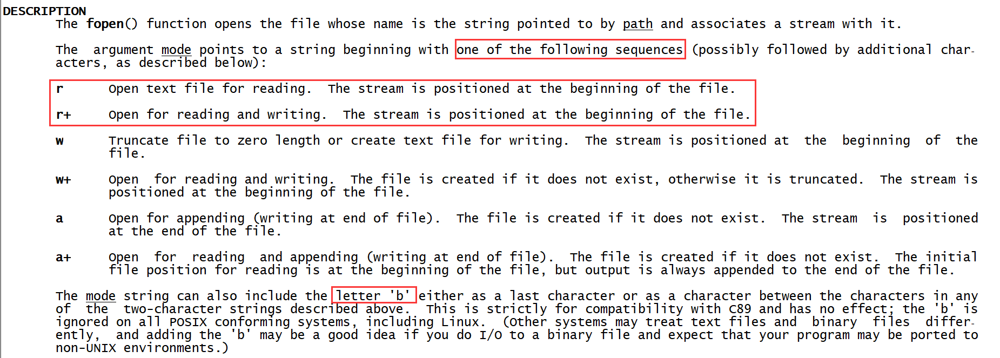

基于IPv4的流媒体广播

# 文件独写 IO

I/O 操作： stdio 标准io；sysio 系统io

​				标准io依赖系统io，不同的系统有不同接口，标准io进行规范统一；

​				使用上，优先使用标准io，标准io会合并系统调用，做一定优化

​				eg:标准fopen： Linux下为open，win下为openfile

stdio:

- [ ] fopen(),fclose()                                                       打开关闭文件
- [ ] fgetc(),fputc(),fgets(),fputs(),fread(),fwrite()       读写操作
- [ ] printf(),scanf()                                                         输入输出
- [ ] fseek(),ftell(),rewind()                                            文件位置指针
- [ ] fflush()                                                                     合并系统调用


## 1 fopen fclose

手册：fopen, fdopen, freopen - stream open functions

```c
NAME
       fopen, fdopen, freopen - stream open functions
SYNOPSIS
       #include <stdio.h>
       FILE *fopen(const char *path, const char *mode);
RETURN VALUE
       Upon successful completion fopen(), fdopen() and freopen() return a FILE pointer.  Otherwise, NULL is returned  and  errno is set to indicate the error.
```
其中const修饰: 使用过程中，我不会改变*path 或 *mode的内容

手册：fclose

```c
NAME
       fclose - close a stream
SYNOPSIS
       #include <stdio.h>
       int fclose(FILE *stream);
RETURN VALUE
       Upon  successful  completion  0  is returned.  Otherwise, EOF is returned and errno is set to indicate the error.  In either case any further access (including another call to fclose()) to the stream results in undefined behavior.
```

------

拓展1 errno

最开始为全局变量-->目前是一个宏

具体：私有化数据，保证没有冲突，把当前出错内容映射到当前地址空间

具体定义在：

```c
klaus@ubuntu:~$ vim /usr/include/asm-generic/errno-base.h 
#ifndef _ASM_GENERIC_ERRNO_BASE_H
#define _ASM_GENERIC_ERRNO_BASE_H

#define EPERM            1      /* Operation not permitted */
#define ENOENT           2      /* No such file or directory */
#define ESRCH            3      /* No such process */
#define EINTR            4      /* Interrupted system call */
#define EIO              5      /* I/O error */
#define ENXIO            6      /* No such device or address */
#define E2BIG            7      /* Argument list too long */
#define ENOEXEC          8      /* Exec format error */
#define EBADF            9      /* Bad file number */
#define ECHILD          10      /* No child processes */
#define EAGAIN          11      /* Try again */
#define ENOMEM          12      /* Out of memory */
#define EACCES          13      /* Permission denied */
#define EFAULT          14      /* Bad address */
#define ENOTBLK         15      /* Block device required */
#define EBUSY           16      /* Device or resource busy */
#define EEXIST          17      /* File exists */
#define EXDEV           18      /* Cross-device link */
#define ENODEV          19      /* No such device */
#define ENOTDIR         20      /* Not a directory */
#define EISDIR          21      /* Is a directory */
#define EINVAL          22      /* Invalid argument */
#define ENFILE          23      /* File table overflow */
#define EMFILE          24      /* Too many open files */
#define ENOTTY          25      /* Not a typewriter */
#define ETXTBSY         26      /* Text file busy */
#define EFBIG           27      /* File too large */
#define ENOSPC          28      /* No space left on device */
#define ESPIPE          29      /* Illegal seek */
#define EROFS           30      /* Read-only file system */
#define EMLINK          31      /* Too many links */
#define EPIPE           32      /* Broken pipe */
#define EDOM            33      /* Math argument out of domain of func */
#define ERANGE          34      /* Math result not representable */
```

------

示例1：fopen打开一个文件

```c
klaus@ubuntu:~/Desktop/linx_c/IO$ cat fopen.c 
#include<stdio.h>
#include<stdlib.h>
#include <errno.h>

int main()
{
    FILE *fp;
    fp = fopen("tmp.txt","r+");
    if(fp == NULL)
    {
        fprintf(stderr,"fopen() failed! errno = %d\n", errno);
        exit(1);
    }
    puts("ok!");
    fclose(fp);
    exit(0);
    }
klaus@ubuntu:~/Desktop/linx_c/IO$ ./fopen 
fopen() failed! errno = 2
```
改进errno成error message ---- perror,void perror(const char *s)

```c
//fprintf(stderr,"fopen() failed!       errno = %d\n", errno);
perror("fopen()");

klaus@ubuntu:~/Desktop/linx_c/IO$ ./fopen 
fopen(): No such file or directory
```
perror可以自动关联全局变量errno，另外为strerror,char *strerror(int errnum)

```c
//fprintf(stderr,"fopen() failed!       errno = %d\n", errno);
//perror("fopen()");
fprintf(stderr,"fopen(): %s\n",strerror(errno));

klaus@ubuntu:~/Desktop/linx_c/IO$ ./fopen 
fopen(): No such file or directory
```
------

mode参数



------

拓展2 FILE *

FILE * 文件指针存放在那个地方 （栈 静态区 堆）

```c
FILE *fopen(const char *path, const char *model)
{
	FILE tmp;                   // 栈上 局部变量地址，结束后就释放掉了（F）
	static FILE tmp;            // 静态区 全局存在唯一 不支持多个打开，因此不能支持（F）
	FILE *tmp = NULL;
	tmp = malloc(sizeof(FILE))  // 堆上 需要fclose 逆操作 谁打开谁关闭 谁申请谁释放
	...
	return ;
}
```

------

拓展3 最大打开文件个数

```c
klaus@ubuntu:~/Desktop/linx_c/IO$ cat max_fopen.c 
#include<stdio.h>
#include<stdlib.h>
#include <errno.h>
#include <string.h>

int main()
{
	FILE *fp = NULL;
	int cnt = 0;
	while(1)
	{
		fp = fopen("tmp.txt","w+");
		if(fp == NULL)
		{
			perror("fopen()");
			break;
		}
		cnt++;
	}
	printf("cnt : %d\n",cnt);
	fclose(fp);

	exit(0);
}
klaus@ubuntu:~/Desktop/linx_c/IO$ ./max_fopen 
fopen(): Too many open files in system
cnt : 84395
Segmentation fault (core dumped)
```

默认打开文件个数 ulimit -a

```c
klaus@ubuntu:~/Desktop/linx_c/IO$ ulimit -a
core file size          (blocks, -c) 0
data seg size           (kbytes, -d) unlimited
scheduling priority             (-e) 0
file size               (blocks, -f) unlimited
pending signals                 (-i) 3610
max locked memory       (kbytes, -l) 64
max memory size         (kbytes, -m) unlimited
open files                      (-n) 1048576
pipe size            (512 bytes, -p) 8
POSIX message queues     (bytes, -q) 819200
real-time priority              (-r) 0
stack size              (kbytes, -s) 8192
cpu time               (seconds, -t) unlimited
max user processes              (-u) 3610
virtual memory          (kbytes, -v) unlimited
file locks                      (-x) unlimited
```

其中默认打开了3个流 stderr stdin stdout，最后是cnt+3，应该是等于open files ，这里有问题待排除

------

拓展4 fopen创建文件权限

默认权限 0666 & ~umask

```c
klaus@ubuntu:~/Desktop/linx_c/IO$ umask
0002
klaus@ubuntu:~/Desktop/linx_c/IO$ ls -l tmp.txt 
-rw-rw-r-- 1 klaus klaus 0 Apr 20 18:24 tmp.txt
```

## 2 fgetc fputc fgets fputs

手册：fgetc, fgets, getc, getchar, ungetc - input of characters and strings

```c
NAME
       fgetc, fgets, getc, getchar, ungetc - input of characters and strings
SYNOPSIS
       #include <stdio.h>
       
       int fgetc(FILE *stream);
       char *fgets(char *s, int size, FILE *stream);
       int getc(FILE *stream);
       int getchar(void);
       int ungetc(int c, FILE *stream);
RETURN VALUE
       fgetc(), getc() and getchar() return the character read as an unsigned char cast to an int or EOF on end of file or error.

       fgets() returns s on success, and NULL on error or when end of file occurs while no characters have been read.

       ungetc() returns c on success, or EOF on error.
```

其中：   getchar() is equivalent to getc(stdin).

手册：fputc, fputs, putc, putchar, puts - output of characters and strings

```c
SYNOPSIS
       #include <stdio.h>

       int fputc(int c, FILE *stream);
       int fputs(const char *s, FILE *stream);
       int putc(int c, FILE *stream);
       int putchar(int c);
       int puts(const char *s);

RETURN VALUE
       fputc(), putc() and putchar() return the character written as an unsigned char cast to an int or EOF on error.

       puts() and fputs() return a nonnegative number on success, or EOF on error.
```

其中：putchar(c) is equivalent to putc(c, stdout)

------

拓展1 fgetc与getc区别

函数原型一样，fgetc被定义成函数使用，getc被当成宏使用，其中宏只占用编译时间，不占用调用时间

------

示例2：实现一个cp功能

```c++
klaus@ubuntu:~/Desktop/linx_c/IO$ cat mycpy.c 
#include <stdio.h>
#include<stdlib.h>

int main(int argc, char **argv)
{
    FILE *fp_src,*fp_dst;
    int ch;
    
    if(argc<3)
    {
        fprintf(stderr,"Usage: %s <src_file>  <dst_file>\n",argv[0]);
        exit(1);
    }
    
    fp_src = fopen(argv[1],"r");
    if(fp_src == NULL)
    {
        perror("fopen()");
        exit(1);
    }
    fp_dst = fopen(argv[2],"w");
    if(fp_dst == NULL)
    {
        fclose(fp_src);
        perror("fopen()");
        exit(1);
    }

    while(1)
    {
        ch = getc(fp_src);
        if(ch == EOF)
            break;
        putc(ch, fp_dst);
    }

    fclose(fp_dst);
    fclose(fp_src);

    exit(0);
}

klaus@ubuntu:~/Desktop/linx_c/IO$ ./mycpy test.c test1.c 
klaus@ubuntu:~/Desktop/linx_c/IO$ diff test.c test1.c
```

示例3：统计简单文件字符个数

```c++
klaus@ubuntu:~/Desktop/linx_c/IO$ cat fgetc.c
#include <stdio.h>
#include<stdlib.h>

int main(int argc, char **argv)
{
    FILE *fp;
    int cnt=0;

    if(argc<2)
    {
        fprintf(stderr,"Usage: %s <cnt_file>\n",argv[0]);
        exit(1);
    }

    fp = fopen(argv[1],"r");
    if(fp == NULL)
    {
        perror("fopen()");
        exit(1);
    }
    while(fgetc(fp)!=EOF)
    {
        cnt++;
    }
    fprintf(stdout,"cnt = %d\n",cnt);
    fclose(fp);
    exit(0);
}
klaus@ubuntu:~/Desktop/linx_c/IO$ ll -l mycpy.c 
-rw-rw-r-- 1 klaus klaus 672 Apr 21 05:29 mycpy.c
klaus@ubuntu:~/Desktop/linx_c/IO$ ./fgetc mycpy.c 
cnt = 672
```

------

拓展2 gets 不检查缓冲区溢出 不推荐使用，使用fgets

手册：gets - get a string from standard input (DEPRECATED)

```c
SYNOPSIS
       #include <stdio.h>

       char *gets(char *s);
DESCRIPTION
       Never use this function.

       gets()  reads  a line from stdin into the buffer pointed to by s until either a terminating newline or EOF, which it replaces with a null byte ('\0').  No check for buffer overrun is performed (see BUGS below).
```

------

示例4：用fgets实现一个cp功能

```c
#define MAX_SIZE 1024
char buff[MAX_SIZE];

while(fgets(buff,MAX_SIZE,fp_src) != NULL)
	assert(fputs(buff,fp_dst)!=EOF && "writing file error!\n");
```

## 3 fwrite fread

手册：fread, fwrite - binary stream input/output(单字节)

```c
SYNOPSIS
       #include <stdio.h>

       size_t fread(void *ptr, size_t size, size_t nmemb, FILE *stream);
       size_t fwrite(const void *ptr, size_t size, size_t nmemb,FILE *stream);
RETURN VALUE
       On  success,  fread()  and  fwrite() return the number of items read or written.  This number equals the number of bytes transferred only when size is 1.  If an error occurs, or the end of the file is reached, the return value is a short item count (or zero).

       fread() does not distinguish between end-of-file and error, and callers must use feof(3) and ferror(3) to determine which occurred.
```

注意：没有进行边界检查，建议进行单字节操作，如文件总共5字节，一次性读10字节，没读到10个返回值为0，无法判断读取情况，且多块字节一起读，一次全错，写出单字节模式fread（buff,1,nmemb,fp);

示例5：用fread实现一个cp功能

```
while((n = fread(buff,1,MAX_SIZE,fp_src)) > 0)
	fwrite(buff,1,n,fp_dst);
```

说明：fread不一定每次都能读到MAX_SIZE的大小，应该是读多少写多少

## 4 printf scanf

手册：printf, fprintf, dprintf, sprintf, snprintf- formatted output conversion

```c
SYNOPSIS
       #include <stdio.h>

       int printf(const char *format, ...);
       int fprintf(FILE *stream, const char *format, ...);
       int dprintf(int fd, const char *format, ...);
       int sprintf(char *str, const char *format, ...);
       int snprintf(char *str, size_t size, const char *format, ...);

RETURN VALUE
       Upon  successful  return,  these  functions  return  the number of characters printed (excluding the null byte used to end output to strings).

       The functions snprintf() and vsnprintf() do not write more than size bytes (including the terminating null  byte  ('\0')).   If  the output  was  truncated  due  to  this limit, then the return value is the number of characters (excluding the terminating null byte) which would have been written to the final string if enough space had been available.  Thus, a return value of size  or  more  means that the output was truncated.  (See also below under NOTES.)

       If an output error is encountered, a negative value is returned.
```

建议多使用fprintf()，不仅仅写到stderr，也可以写到其他成功打开的流文件里面去

手册：scanf, fscanf, sscanf, vscanf, vsscanf, vfscanf - input format conversion

```c
SYNOPSIS
       #include <stdio.h>

       int scanf(const char *format, ...);
       int fscanf(FILE *stream, const char *format, ...);
       int sscanf(const char *str, const char *format, ...);
RETURN VALUE
       On success, these functions return the number of input items successfully matched and assigned; this can be fewer than provided for, or even zero, in the event of an early matching failure.

       The value EOF is returned if the end of input is reached before either the first successful conversion or a matching failure occurs.
       EOF is also returned if a read error occurs, in which case the error indicator for the stream (see ferror(3)) is set, and  errno  is set to indicate the error.
```

注意：scanf不知道读入尺寸多大！

------

拓展1：atio

手册：atoi, atol, atoll - convert a string to an integer

```c
 SYNOPSIS
       #include <stdlib.h>

       int atoi(const char *nptr);
       long atol(const char *nptr);
       long long atoll(const char *nptr);
       
RETURN VALUE
       The converted value.
```

示例6 将字符串转数字

```c
klaus@ubuntu:~/Desktop/linx_c/IO$ cat atio.c 
#include <stdio.h>
#include<stdlib.h>

int main(int argc, char **argv)
{
    char buf[] = "123456";
    char bufa[] = "123a456";//遇到非数字停止

    fprintf(stdout,"buf: %d, bufa: %d\n",atoi(buf),atoi(bufa));
    exit(0);
}
klaus@ubuntu:~/Desktop/linx_c/IO$ ./atio 
buf: 123456, bufa: 123
```

示例7 使用sprintf将int转成char，与atoi功能相反

```
int year = 2021, month = 4, day = 21;
char str[1024];
sprintf(str,"Today is %d-%d-%d",year,month,day);
puts(str);
```

## 5 fseek ftell rewind

手册：fgetpos, fseek, fsetpos, ftell, rewind - reposition a stream

```c
SYNOPSIS
       #include <stdio.h>

       int fseek(FILE *stream, long offset, int whence);
       long ftell(FILE *stream);
       void rewind(FILE *stream);

       int fgetpos(FILE *stream, fpos_t *pos);
       int fsetpos(FILE *stream, const fpos_t *pos);
RETURN VALUE
       The rewind() function returns no value.  Upon successful completion, fgetpos(), fseek(), fsetpos() return 0, and ftell() returns the current offset.  Otherwise, -1 is returned and errno is set to indicate the error.
```

文件位置指针 ，offset：偏移量；whence：偏移相对位置，再看具体描述

```c
DESCRIPTION
       The  fseek()  function sets the file position indicator for the stream pointed to by stream.  The new position, measured in bytes, is obtained by adding offset bytes to the position specified by whence.  If whence is set to SEEK_SET, SEEK_CUR, or SEEK_END, the  offset  is  relative  to  the start  of  the  file, the current position indicator, or end-of-file, respectively.  A successful call to the fseek() function clears the end-of- file indicator for the stream and undoes any effects of the ungetc(3) function on the same stream.

       The ftell() function obtains the current value of the file position indicator for the stream pointed to by stream.

       The rewind() function sets the file position indicator for the stream pointed to by stream to the beginning of the file.  It is equivalent to:

              (void) fseek(stream, 0L, SEEK_SET)

       except that the error indicator for the stream is also cleared (see clearerr(3)).

       The fgetpos() and fsetpos() functions are alternate interfaces equivalent to ftell() and fseek() (with whence set to SEEK_SET), setting and storing  the current value of the file offset into or from the object referenced by pos.  On some non-UNIX systems, an fpos_t object may be a complex object and these routines may be the only way to portably reposition a text stream.

RETURN VALUE
       The rewind() function returns no value.  Upon successful completion, fgetpos(), fseek(), fsetpos() return 0, and ftell() returns the current off‐set.  Otherwise, -1 is returned and errno is set to indicate the error.
```

其中：rewind()  == (void) fseek(stream, 0L, SEEK_SET)，文件位置指针seek到了开始处

------

拓展1： 空洞文件，assic值全为0的文件。如下载文件时，会首先创建一个空文件，用fseek打开文件，从0偏移到文件大小，其中文件写的字节全为\0，这个assic全为0的文件就是空洞文件。

------

示例8，使用fseek统计文件大小

```c
assert(fseek(fp,0,SEEK_END) == 0 && "文件读出错");
cnt = ftell(fp);
fprintf(stdout,"cnt = %ld\n",cnt);

klaus@ubuntu:~/Desktop/linx_c/IO$ ls -l flen.c 
-rw-rw-r-- 1 klaus klaus 480 Apr 22 18:18 flen.c
klaus@ubuntu:~/Desktop/linx_c/IO$ ./flen flen.c 
cnt = 480
```

## 6 ftello fseeko

手册：fgetpos, fseek, fsetpos, ftell, rewind - reposition a stream

```c
int fseek(FILE *stream, long offset, int whence);
```

注意 ：传入的long类型，long类型与平台相关，long数据-2G~+2G，只能用到0-2G，适用于c89 c99

针对long字节不同平台，出现了ftello和fseeko

手册：fseeko, ftello - seek to or report file position

```c
SYNOPSIS
       #include <stdio.h>

       int fseeko(FILE *stream, off_t offset, int whence);

       off_t ftello(FILE *stream);

   Feature Test Macro Requirements for glibc (see feature_test_macros(7)):

       fseeko(), ftello():
           _FILE_OFFSET_BITS == 64 || _POSIX_C_SOURCE >= 200112L || _XOPEN_SOURCE >= 600 (defining the obsolete _LARGEFILE_SOURCE macro also works)

DESCRIPTION
       The  fseeko()  and  ftello()  functions  are  identical to fseek(3) and ftell(3) (see fseek(3)), respectively, except that the offset argument of fseeko() and the return value of ftello() is of type off_t instead of long.

       On some architectures, both off_t and long are 32-bit types, but defining _FILE_OFFSET_BITS with the value 64 (before including any header files) will turn off_t into a 64-bit type.
```

适用于：POSIX.1-2001, POSIX.1-2008, SUSv2.

## 7 fflush

手册：fflush - flush a stream

```c
SYNOPSIS
       #include <stdio.h>

       int fflush(FILE *stream);
DESCRIPTION
       For  output  streams,  fflush()  forces a write of all user-space buffered data for the given output or update stream via the stream's underlying write function.

       For input streams associated with seekable files (e.g., disk files, but not pipes or terminals), fflush() discards any  buffered  data  that  has been fetched from the underlying file, but has not been consumed by the application.

       The open status of the stream is unaffected.
       If the stream argument is NULL, fflush() flushes all open output streams.
       For a nonlocking counterpart, see unlocked_stdio(3).

RETURN VALUE
       Upon successful completion 0 is returned.  Otherwise, EOF is returned and errno is set to indicate the error.
```

功能：刷新缓冲区，缓冲区作用：大部分场景有用，用来合并系统调用，有3种缓冲格式

- 行缓冲：换行时刷新缓冲区，行满了刷新，强制刷新（fflush、标准输出就是强制刷新，因为要输出到终端设备）
- 全缓冲：缓冲区满了刷新，强制刷新（默认全缓冲，有终端设备默认行缓冲）
- 无缓冲：如stderr，需要立即输出内容

示例9 程序日常debug

```c
klaus@ubuntu:~/Desktop/linx_c/IO$ cat fflush.c 
#include <stdio.h>
#include <stdlib.h>

int main()
{
    printf("[%s:%d] before while...",__FUNCTION__,__LINE__);
    fflush(stdout);
    while(1);
    printf("[%s:%d] after while...",__FUNCTION__,__LINE__);
    fflush(NULL);

    exit(0);
}
klaus@ubuntu:~/Desktop/linx_c/IO$ ./fflush 
[main:6] before while...
```

现在是终端设备，默认行缓冲，加一个换行符，遇到换行符输出

```c
printf("[%s:%d] before while...\n",__FUNCTION__,__LINE__);
while(1);
printf("[%s:%d] after while...\n",__FUNCTION__,__LINE__);
```

# 标准 IO

## 1 getline

手册