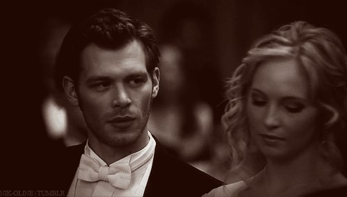

My name came from Niklaus Mikaelson（Klaus). which is corner of Klaus from "The Originals"

- One of the ancestors of the vampire
- Possess the dual bloodline of werewolves and vampires

What else do you need?

加油，打工人！一起为老板的梦想奋斗。

### Klaus' story

"The Originals" is a derivative drama of "The Vampire Diaries", produced by Columbia and Warner Bros.

 United Television Network. Directed by Chris Grisme, Joseph Morgan, starring Daniel Gillies. The play tells the thrilling story of Nicklaus, Elijah, and Rebecca, members of the first-generation vampire family, after returning to settle in New Orleans, and their predecessor, Marcel, began a struggle for dominance and a struggle with regional witches. The show premiered on October 3, 2013.

